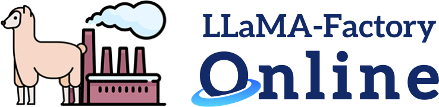

# LLaMA-Factory-Online

  

<h1 align="center">🦙 LLaMA-Factory Online</h1>

  <b>无需代码 Easy微调</b> 
  在线大模型训练与微调服务平台

  
  
  

---

## 🚀 产品介绍

**LLaMA-Factory Online**是与明星开源项目LLaMA-Factory官方合作打造的**在线大模型训练与微调服务平台**，底层提供高性能、高弹性GPU算力资源，为具有微调需求、编码与工程能力较为基础的用户群体，提供开箱即用、低代码、全链路功能覆盖的大模型训练与微调服务。它将微调流程重构为一个**可视化、在线化、低代码的一站式云端服务**，让团队能专注于业务或技术实现本身，无需困扰资源与配置问题，为开发提效。

### ✨ 核心功能
- 🧠 **100+模型随心选择**：涵盖LLaMA/Qwen/DeepSeek/GPT-OSS等主流大模型  
- ⚡ **训练算法齐全**：支持预训练、SFT、Reward Modeling、PPO/DPO/KTO等多种训练方式  
- 🧩 **运算精度灵活**：覆盖16bit全参数微调、冻结微调、LoRA微调和基于2/3/4/5/6/8bit的QLoRA微调  
- 📈 **优化算法先进**：内置LlamaBoard/TensorBoard/Wandb/Mlflow/SwanLab等实时监控工具  
- ☁️ **实验监控完善**：生成API、Web Demo、Docker镜像，一键上线
- 🚀 **训练推理高效**：采用FlashAttention-2/Unsloth等加速算子，支持 Transformers/vLLM推理引擎

👉 **[注册送券，免费体验 → LLaMA-Factory Online](https://www.llamafactory.com.cn/?utm_source=jslt_github0)**

---

## 📚 数据集精选

精选中英文各行业开源数据集，助你快速构建专属模型：

| 🌐 类型 | 📦 数据集示例 | 🔗 下载入口 |
|:--|:--|:--|
| 自动驾驶多模态图像理解数据集 | QA_from_CoVLA_zh | [🔗 Hugging Face](https://huggingface.co/datasets/AlayaNeW/QA_from_CoVLA_zh) |
| 对话/问答 | ShareGPT | [🔗 Hugging Face](https://huggingface.co/datasets/ShareGPT) |
| 中文指令 | Firefly-Mix-1.1M | [🔗 Hugging Face](https://huggingface.co/datasets/YeungNLP/firefly-train-1.1M) |
| 专业领域 | Finance-GPT | [🔗 Hugging Face](https://huggingface.co/datasets/hello-simpleai/Finance-GPT) |
| 医疗问答 | Med-Dialog-CN | [🔗 Hugging Face](https://huggingface.co/datasets/medicalai/MedDialog) |

---

## 🧪 最佳实践

从入门到进阶，我们准备了系统化的实践教程与案例库：

| 🧩 主题 | 📝 简介 | 🔗 跳转 |
|:--|:--|:--|
| 🎓 ​基于Qwen3-8B与LightLLM高效复杂语义理解应用 | ​Qwen3-8B凭借80亿参数和128K长上下文，兼具“快思考”与“慢思考”能力，配合高效推理框架LightLLM，可实现高并发、低延迟的稳定服务。二者结合，不仅显著提升生成质量与响应效率，更适用于智能客服、知识问答、内容生成等企业级场景，成为落地大模型应用的高效实用方案。 | [➡ 阅读教程](https://docs.llamafactory.online/docs/documents/best-practice/qwen3-8B) |
| 👩‍⚕️ 基于CareGPT医疗目标的Qwen3-8B模型微调之旅 | CareGPT是一款针对医疗健康领域优化的开源大语言模型项目，核心通过领域适应训练提升模型在医疗场景的专业性与可靠性，助力医疗人工智能技术普及应用。本文档指导您如何在LLaMA Factory Online平台实现基于CareGPT医疗目标的Qwen3-8B模型微调实践。 | [➡ 阅读教程](https://docs.llamafactory.online/docs/documents/best-practice/caregpt) |
| 🔬 构建基于Qwen3-8B的沉浸式苏东坡角色扮演大模型 | 当代文化内容爆发式增长的背景下，角色扮演技术不断创新升级。基于Qwen3-8B的生成式AI技术，使用户能够突破时空限制，与苏东坡进行深度对话和个性化交流，为文化IP运营、沉浸式教育、历史体验及心理陪伴等领域创造新价值。 | [➡ 阅读教程](https://docs.llamafactory.online/docs/documents/best-practice/Dongpo) |
| 🎁 GPU 福利季活动 | 新用户注册有礼、邀新返现、充值福利 | [➡ 了解活动](https://llamafactory.online/events) |

---

## 🤝 加入我们

📢 **官方网站**  
👉 [https://llamafactory.online](https://www.llamafactory.com.cn/?utm_source=jslt_github0)

🏠 **社区与交流群**  
- 💬 微信：扫描下方二维码领取代金券与微调资料包

  

  
- 📢 微信公众号: 大模型微调online，期待您的关注
- 📚 CSDN: 

📮 **商务合作与校园大使计划**  
请邮件至：**contact@llamafactory.online**

> 🦙「让微调变得像写提示词一样简单。」

---

## 📜 许可协议

本项目内容遵循 [MIT License](LICENSE)。  
所有示例数据集版权归原作者所有。  
本页展示的数据与教程仅用于学术与非商业用途。

---
